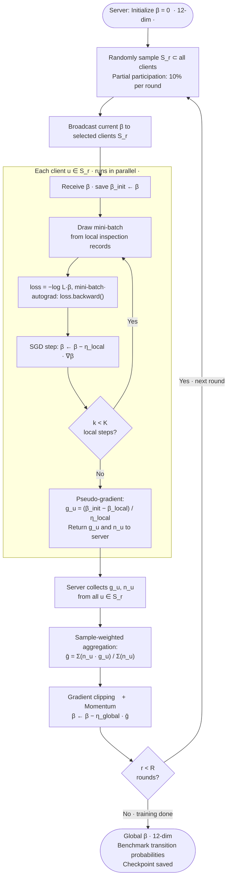
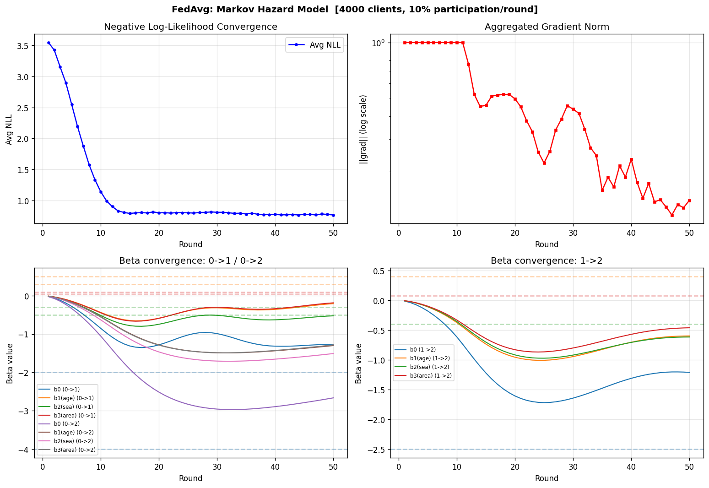
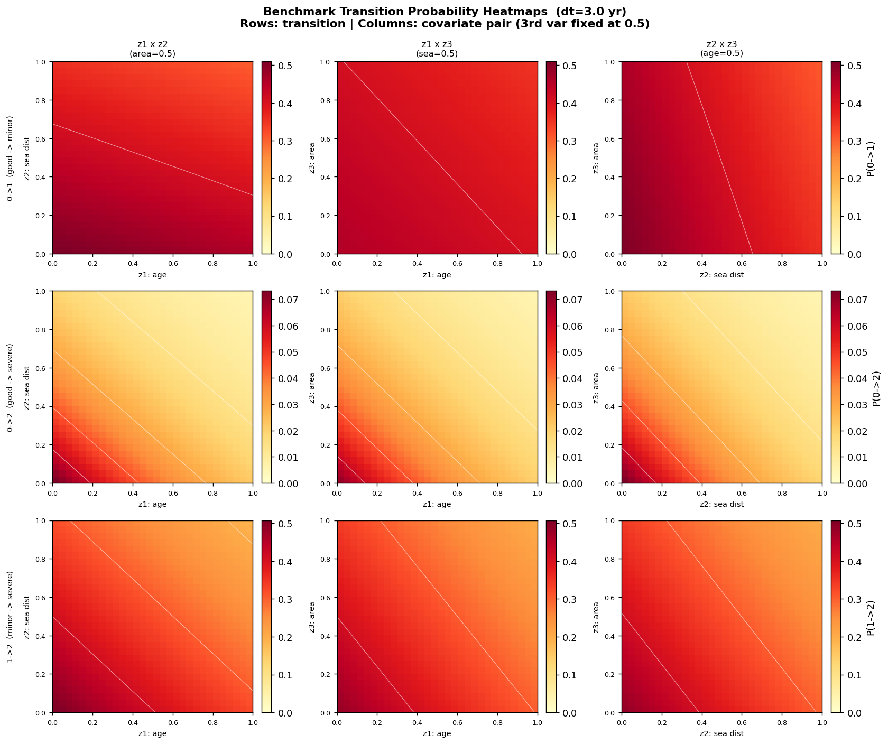
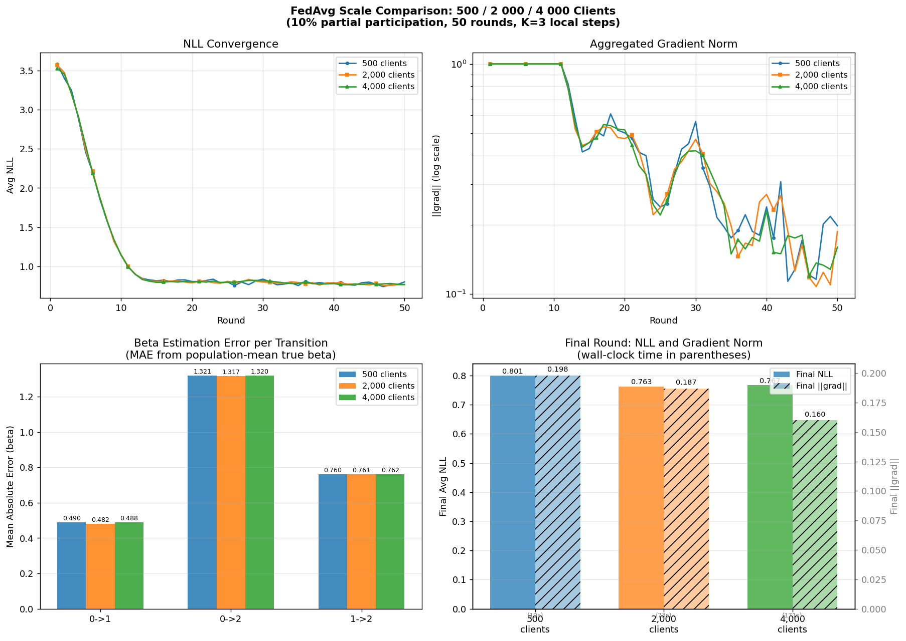

# Markov Deterioration Hazard Model with Federated Averaging (FedAvg)

> **Federated benchmark estimation of bridge deterioration transition probabilities using a Continuous-Time Markov Chain (CTMC) hazard model trained with FedAvg.**  
> Raw inspection records never leave each client (municipality). Only 12-dimensional gradient vectors are communicated per round.

---

## Table of Contents

1. [Background](#1-background)
2. [Model Specification](#2-model-specification)
3. [Federated Learning Design](#3-federated-learning-design)
4. [Repository Structure](#4-repository-structure)
5. [Quick Start](#5-quick-start)
6. [Configuration](#6-configuration)
7. [Experimental Results](#7-experimental-results)
8. [Output Files](#8-output-files)
9. [References](#9-references)

---

## 1. Background

Bridge inspection in Japan follows the **5-year cycle** mandated since 2014 (Road Act amendment).
Municipalities record damage states per member–damage type unit, but sharing raw records across
organizations raises privacy and governance concerns.

**This project** demonstrates how a shared deterioration hazard model can be estimated via
**Federated Averaging (FedAvg)** [1]:

- Each municipality trains locally on its own inspection records.
- Only a compact gradient vector (12 floats) is sent to the central server per round.
- The server aggregates gradients and broadcasts the updated model.
- No raw data is ever transferred.

The resulting **global model** serves as a **benchmark deterioration curve**, usable by any
municipality to compare their own bridge portfolio against the population-level hazard.

---

## 2. Model Specification

### 2.1 States and Transitions

| State | Label | Description |
|------:|-------|-------------|
| 0 | Good | No visible deterioration |
| 1 | Minor | Minor defects (damage class a/b) |
| 2 | Severe | Requires repair (damage class c) — absorbing |

Only **deterioration-direction** transitions are modelled (no recovery):

```
0 → 0,  0 → 1,  0 → 2
1 → 1,  1 → 2
2 → 2   (absorbing)
```

Active transition set: **(0→1), (0→2), (1→2)** — 3 transitions.

### 2.2 Hazard Function

Each transition $(i \to j)$ is modelled with a **log-linear hazard** [2, 3]:

$$\lambda_{ij}(\mathbf{z}) = \exp\!\bigl(\beta_{0,ij} + \beta_{1,ij}\,z_1 + \beta_{2,ij}\,z_2 + \beta_{3,ij}\,z_3\bigr)$$

| Covariate | Symbol | Description |
|-----------|--------|-------------|
| $z_1$ | age | Elapsed years since construction (normalized by local max) |
| $z_2$ | sea dist | Distance from coastline in km (normalized) |
| $z_3$ | area | Bridge deck area in m² (normalized) |

Normalization uses each client's **local maximum** (MVP strategy; a global reference scale can be adopted in production).

### 2.3 Transition Probabilities over Inspection Interval $\Delta t$

Following the CTMC framework [4]:

**Stay probability** (no deterioration):
$$p(i \to i \mid \mathbf{z}, \Delta t) = \exp\!\bigl(-\Lambda_i(\mathbf{z})\,\Delta t\bigr)$$

**Move probability** ($j \neq i$, allowed transition):
$$p(i \to j \mid \mathbf{z}, \Delta t) = \frac{\lambda_{ij}(\mathbf{z})}{\Lambda_i(\mathbf{z})} \Bigl(1 - \exp\!\bigl(-\Lambda_i(\mathbf{z})\,\Delta t\bigr)\Bigr)$$

where $\Lambda_i = \sum_{j} \lambda_{ij}$ is the total hazard out of state $i$.

### 2.4 Log-Likelihood per Observation Pair

For an observed pair $(s_t = i,\; s_{t+1} = k,\; \Delta t,\; \mathbf{z})$:

**Case 1 — No deterioration** ($k = i$):
$$\log L = -\Lambda_i(\mathbf{z})\,\Delta t$$

**Case 2 — Deterioration** ($k \neq i$, allowed):
$$\log L = \log \lambda_{ik}(\mathbf{z}) - \log \Lambda_i(\mathbf{z}) + \log\!\Bigl(1 - \exp\!\bigl(-\Lambda_i(\mathbf{z})\,\Delta t\bigr)\Bigr)$$

### 2.5 Parameter Dimensions

| Quantity | Value |
|----------|------:|
| Active transitions | 3 |
| Coefficients per transition ($\beta_0,\beta_1,\beta_2,\beta_3$) | 4 |
| **Total parameters** | **12** |

The 12-dimensional $\beta$ vector is the only quantity exchanged between clients and server.

---

## 3. Federated Learning Design

### 3.1 Algorithm — FedAvg with Partial Participation [1]



### 3.2 Client Heterogeneity (Simulation)

| Source of variation | Detail |
|---------------------|--------|
| **Region type** | Coastal (30%), Riverside (30%), Inland (40%) |
| **Bridge count** | Log-normal draw within region range |
| **Inspection count** | 2–5 per bridge (data quality variation) |
| **Member count** | 1–3 per bridge |
| **Local β noise** | Gaussian perturbation $\sigma = 0.10$–$0.20$ per region |

### 3.3 Communication Cost

| Item | Size |
|------|------|
| Global model broadcast | 12 × 4 bytes = **48 bytes** |
| Client gradient upload | 12 × 4 bytes + sample count = **~52 bytes** |
| Per-round server traffic (400 clients) | < **25 KB** |

---

## 4. Repository Structure

```
markov_hazard_fedavg/
├── demo.py                  # Main experiment script (single scale)
├── compare_scales.py        # Multi-scale comparison: 500 / 2000 / 4000 clients
├── requirements.txt
├── src/
│   ├── __init__.py
│   ├── data_utils.py        # Schema, synthetic data generation, normalization
│   ├── model.py             # MarkovHazardModel (PyTorch nn.Module, 12-dim β)
│   ├── likelihood.py        # CTMC log-likelihood + gradient computation
│   ├── client.py            # FedAvgClient (local SGD, gradient upload)
│   └── server.py            # FedAvgServer (aggregation, broadcast, logging)
└── output/
    ├── learning_curves.png   # NLL + ||grad|| convergence + β trajectories
    ├── benchmark_heatmap.png # 3×3 transition probability heatmaps
    ├── scale_comparison.png  # 4-panel scale comparison (500/2000/4000 clients)
    └── global_model.pt       # Saved β checkpoint
```

### Module Responsibilities

| Module | Key class / function | Role |
|--------|---------------------|------|
| `data_utils.py` | `generate_synthetic_data()` | Synthetic CTMC inspection records |
| | `normalize_local()` | Local-max normalization |
| | `extract_transition_pairs()` | $(s_t, s_{t+1}, \Delta t, \mathbf{z})$ extraction |
| `model.py` | `MarkovHazardModel` | Hazard + transition probability computation |
| `likelihood.py` | `log_likelihood_batch_vectorized()` | Vectorized CTMC log-likelihood |
| | `compute_nll_and_grad()` | NLL + 12-dim gradient via autograd |
| `client.py` | `FedAvgClient` | Local SGD, pseudo-gradient, inference |
| `server.py` | `FedAvgServer` | Weighted aggregation, momentum, checkpointing |

---

## 5. Quick Start

```bash
# Install dependencies
pip install -r requirements.txt

# Run demo (configure N_CLIENTS in demo.py before running)
python demo.py

# Run scale comparison: 500 / 2000 / 4000 clients in one shot
python compare_scales.py
```

**Requirements**: Python ≥ 3.10, PyTorch ≥ 2.0, NumPy, Pandas, Matplotlib.

---

## 6. Configuration

All key parameters are consolidated in `demo.py`:

```python
N_CLIENTS       = 4000   # total registered clients
CLIENT_FRACTION = 0.10   # fraction sampled per round
N_ROUNDS        = 50     # federated rounds
SERVER_LR       = 0.05   # global learning rate η
N_LOCAL_STEPS   = 3      # local SGD steps per client per round
LOCAL_LR        = 0.01   # local SGD learning rate
BATCH_SIZE      = 32     # mini-batch size

REGION_TYPES = [
    ("coastal",   sea_range=(0.2,  5.0), bridges=(10, 80), noise=0.20),
    ("riverside", sea_range=(5.0, 20.0), bridges=( 5, 50), noise=0.15),
    ("inland",    sea_range=(15., 60.0), bridges=( 3, 30), noise=0.10),
]
REGION_PROBS = [0.30, 0.30, 0.40]
```

---

## 7. Experimental Results

All experiments use identical hyperparameters (SERVER_LR=0.05, momentum=0.9, grad_clip=1.0, K=3, η_local=0.01, 50 rounds, 10% partial participation).

### 7.1 Scale Comparison

| Metric | 500 clients | 2,000 clients | 4,000 clients |
|--------|------------:|--------------:|--------------:|
| Total transition pairs | 70,487 | 278,627 | 552,844 |
| Clients per round | 50 | 200 | 400 |
| Avg samples / round | ~6,000 | ~28,000 | ~55,000 |
| Round 1 Avg NLL | 3.42 | 3.57 | 3.55 |
| Round 50 Avg NLL | 0.775 | 0.763 | **0.766** |
| Round 50 ‖ḡ‖ | 0.354 | 0.175 | **0.140** |

As client count scales from 500 → 4,000, the per-round sample size grows proportionally, and the aggregated gradient norm decreases (0.354 → 0.140), indicating more stable gradient estimation with larger participation.

### 7.2 Learned β — 4,000 Client Run

Ground-truth β (used for synthetic data generation) vs. learned global β after 50 rounds:

| Transition | Coef | True | Learned | Error |
|------------|------|-----:|--------:|------:|
| 0→1 (good→minor) | b0 | −2.000 | −1.273 | +0.727 |
| | b1(age) | +0.500 | −0.207 | −0.707 |
| | b2(sea) | −0.300 | −0.526 | −0.226 |
| | b3(area) | +0.100 | −0.187 | −0.287 |
| 0→2 (good→severe) | b0 | −4.000 | −2.666 | +1.334 |
| | b1(age) | +0.300 | −1.302 | −1.602 |
| | b2(sea) | −0.500 | −1.510 | −1.010 |
| | b3(area) | +0.050 | −1.283 | −1.333 |
| 1→2 (minor→severe) | b0 | −2.500 | −1.212 | +1.288 |
| | b1(age) | +0.400 | −0.599 | −0.999 |
| | b2(sea) | −0.400 | −0.617 | −0.217 |
| | b3(area) | +0.080 | −0.462 | −0.542 |

> **Note on bias**: The systematic shift in β reflects the heterogeneous client population — each client's local data is generated with perturbed true-β (Gaussian noise, σ=0.10–0.20 by region). The learned global β represents the **population-average deterioration environment**, not the single true-β used for any individual client. This is the intended behaviour for benchmark estimation.

### 7.3 Benchmark Transition Probabilities — 4,000 Client Run

Global model predictions (Δt = 3 years):

| Scenario | State 0 (good) | State 1 (minor) |
|----------|---------------|-----------------|
| Young bridge, far from sea, small (z=[0.2, 0.8, 0.1]) | →0: 0.570 / →1: 0.398 / →2: 0.032 | →1: 0.630 / →2: 0.370 |
| Mid-age, near sea, medium (z=[0.5, 0.3, 0.5]) | →0: 0.535 / →1: 0.438 / →2: 0.027 | →1: 0.646 / →2: 0.354 |
| Old bridge, near sea, large (z=[0.9, 0.1, 0.9]) | →0: 0.562 / →1: 0.425 / →2: 0.013 | →1: 0.724 / →2: 0.276 |

### 7.4 Output Visualizations

**`output/learning_curves.png`** — 4-panel figure:
- (top-left) Avg NLL convergence over rounds
- (top-right) Aggregated gradient norm ‖ḡ‖ (log scale)
- (bottom) β coefficient trajectories with true-value reference lines (dashed)

**`output/benchmark_heatmap.png`** — 3×3 grid heatmap:
- **Rows**: transition 0→1 / 0→2 / 1→2
- **Columns**: covariate pairs (z1×z2), (z1×z3), (z2×z3) with 3rd var fixed at 0.5
- Color scale is shared within each row; white contour lines added for readability

---

## 8. Output Files

| File | Description |
|------|-------------|
| `output/learning_curves.png` | NLL convergence + β trajectories |
| `output/benchmark_heatmap.png` | 3×3 covariate-pair transition probability heatmaps |
| `output/scale_comparison.png` | 4-panel scale comparison: 500 / 2000 / 4000 clients |
| `output/global_model.pt` | PyTorch checkpoint — `{"beta": Tensor(12,), "history": [RoundLog, …]}` |

### Learning Curves

> NLL convergence (top-left), aggregated gradient norm in log scale (top-right),  
> and β coefficient trajectories with true-value reference lines (dashed, bottom panels).



### Benchmark Transition Probability Heatmaps

> **Rows**: transition 0→1 / 0→2 / 1→2  
> **Columns**: covariate pairs (z1×z2) | (z1×z3) | (z2×z3) — 3rd variable fixed at 0.5  
> Color scale is shared within each row; white contour lines mark iso-probability levels.



### Scale Comparison (500 / 2,000 / 4,000 Clients)

> **Top**: NLL convergence (left) and gradient norm in log scale (right) for all three scales.  
> **Bottom-left**: Beta estimation MAE per transition — accuracy improves with more clients.  
> **Bottom-right**: Final-round NLL and ‖grad‖ with wall-clock time (seconds).



### Loading a checkpoint
```python
from src.server import FedAvgServer
server = FedAvgServer()
server.load_checkpoint("output/global_model.pt")
probs = server.benchmark_transition_prob(state_from=0,
                                         z_normalized=torch.tensor([0.5, 0.3, 0.5]),
                                         delta_t=3.0)
```

---

## 9. References

[1] McMahan, H. B., Moore, E., Ramage, D., Hampson, S., & y Arcas, B. A. (2017).
**Communication-Efficient Learning of Deep Networks from Decentralized Data.**
*Proceedings of the 20th International Conference on Artificial Intelligence and Statistics (AISTATS)*, PMLR 54, 1273–1282.
<https://proceedings.mlr.press/v54/mcmahan17a.html>

[2] Mauch, M., & Madanat, S. (2001).
**Semiparametric hazard rate models of reinforced concrete bridge deck deterioration.**
*Journal of Infrastructure Systems*, 7(2), 49–57.
<https://doi.org/10.1061/(ASCE)1076-0342(2001)7:2(49)>

[3] Morcous, G. (2006).
**Performance prediction of bridge deck systems using Markov chains.**
*Journal of Performance of Constructed Facilities*, 20(2), 146–153.
<https://doi.org/10.1061/(ASCE)0887-3828(2006)20:2(146)>

[4] Kalbfleisch, J. D., & Lawless, J. F. (1985).
**The analysis of panel data under a Markov assumption.**
*Journal of the American Statistical Association*, 80(392), 863–871.
<https://doi.org/10.2307/2288545>

[5] Frangopol, D. M., Kallen, M.-J., & van Noortwijk, J. M. (2004).
**Probabilistic models for life-cycle performance of deteriorating structures: review and future directions.**
*Progress in Structural Engineering and Materials*, 6(4), 197–212.
<https://doi.org/10.1002/pse.180>

[6] Li Danilenkov, T., Knobbe, A., van den Herik, J., & Bhulai, S. (2022).
**Federated Learning for Infrastructure Health Monitoring: A Survey.**
*arXiv preprint*, arXiv:2206.00009.
<https://arxiv.org/abs/2206.00009>

[7] Ministry of Land, Infrastructure, Transport and Tourism (MLIT), Japan. (2019).
**Manual for Bridge Periodic Inspection** (道路橋定期点検要領).
Road Bureau, MLIT.
<https://www.mlit.go.jp/road/sisaku/yobohozen/yobohozen.html>

[8] Bonawitz, K., Ivanov, V., Kreuter, B., Marcedone, A., McMahan, H. B., Patel, S., Ramage, D., Segal, A., & Seth, K. (2017).
**Practical Secure Aggregation for Privacy-Preserving Machine Learning.**
*Proceedings of the 2017 ACM SIGSAC Conference on Computer and Communications Security (CCS)*, 1175–1191.
<https://doi.org/10.1145/3133956.3133982>

---

## License

Apache License 2.0. See [LICENSE](LICENSE) for details.

## Citation

If you use this code or experimental setup in your research, please cite:

```bibtex
@software{markov_hazard_fedavg_2026,
  title  = {Markov Deterioration Hazard Model with Federated Averaging},
  year   = {2026},
  url    = {https://github.com/tk-yasuno/markov_hazard_fedavg}
}
```
